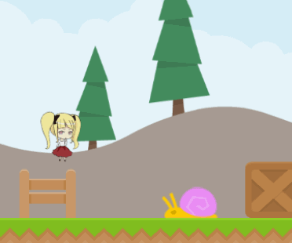
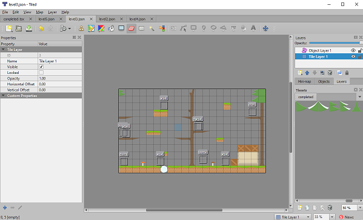

# Twin Tales!


## [live](https://twintales.herokuapp.com/)

This is a platformer game where you control two characters that share the same input. The goal is to get them both at the door at the same time!

# Technologies:
* JavaScript
* Tiled

# Features:
## Murder feedback


When your character squashes an innocent snail, there's a subtle stop to give the feeling that she really did just knock something out of existence.

```javascript
steppedAction(dt){
    if (this.stepped === true) {
        this.dx = 0;
        this.ddx = 0;
        this.afterStep = true
        this.stepped = false
    }
}
update(dt){
    if (this.afterStep) {
        this.ddy = (this.ddy - this.impulse);  // this makes her jump a little.
        this.afterStep = false
    }
}

```
The split second when the character collides with the enemy from above, a flag gets turned on to give that character an instaneous jump.


## Animated Clouds


A dual layer background where there's a static mountain backdrop and one with moving clouds.

```javascript
animateBackground(){
    let scrollSpeed = 0.2

    if (this.scrollVal >= this.width){
        this.scrollVal = 0;
    }

    this.scrollVal += scrollSpeed;

    this.ctx.drawImage(
        animatedBackground1, 
        this.width - this.scrollVal, 
        0, 
        this.width, 
        this.height, 
        );
    
    this.ctx.drawImage(
        animatedBackground1,
        - this.scrollVal,
        0,
        this.width,
        this.height
    );
}
```

The first canvas draw method draws with an x coordinate equal to the width of the canvas which means it'll start drawing on the right side. The second method draws the background entirely but gradually gets narrower due to the increasing scrollVal. A looping effect is achieved by matching these two together.

## Tiled Integration


There was a need to find an easier and faster way to create stages. That is why this project uses Tiled which is a free level editor. Contrary to the screenshot, Tiled doesn't export everything if it's saved as a json. It only exports the locations of moveable objects and static platforms in one very long array. 

```javascript
    data: [1, 0, 0, 0, 0, 0, 0, 0, 0, 0...]
```

This long array is equivalent to product of the width and the height of the canvas. With that, each element can be plotted to the canvas using math.

```javascript
    tileCell(tx, ty, cells, MAPSIZE){
        return cells[tx + (ty * MAPSIZE.tw)]
    }
```

There's a hash object that houses all the coordinates of each texture in the spritesheet and the numbers in that long array is the key. This object was generated when the spritesheet was created using this website https://www.codeandweb.com/free-sprite-sheet-packer . Tiled unfortunately does not have this feature.

```javascript
"frames": {
    "001": {
        "frame": {
            "x": 0,
            "y": 0,
            "w": 70,
            "h": 70
        },
    }
}
```

Using this library of textures, canvas can paint the platforms with a multitude of flavors!